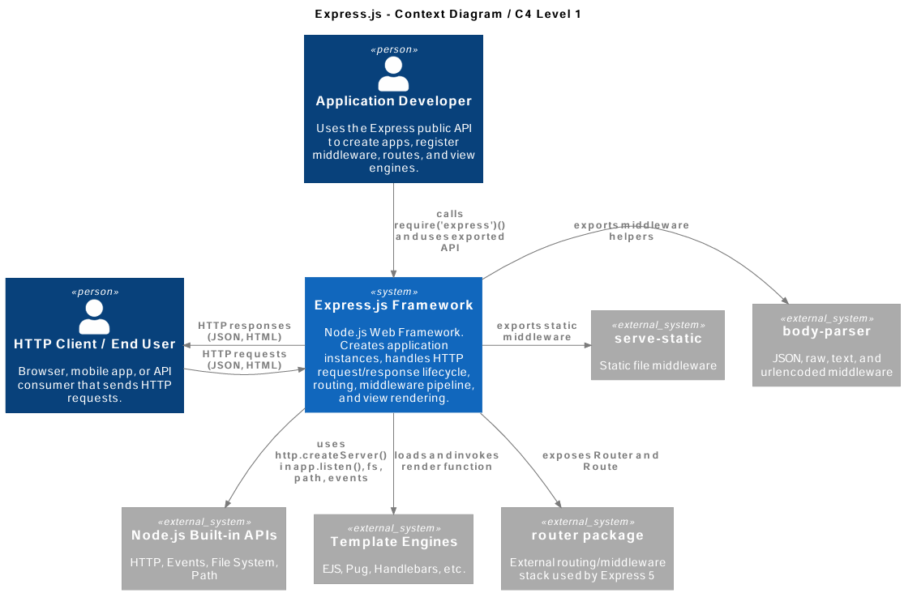
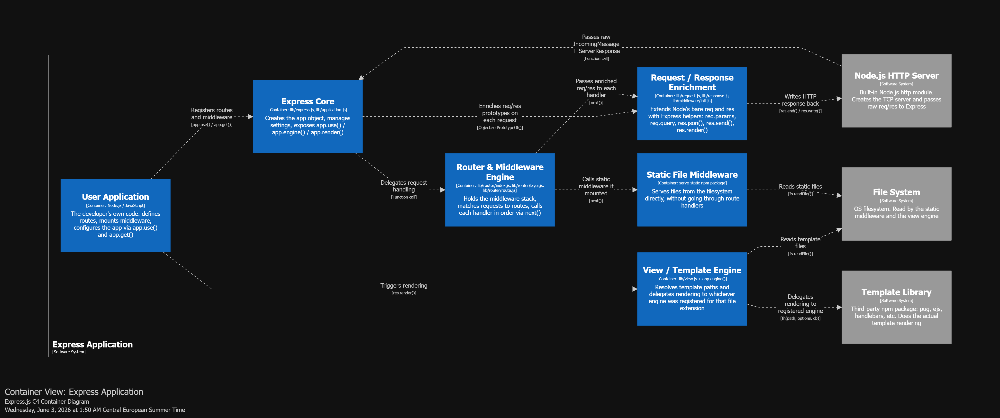
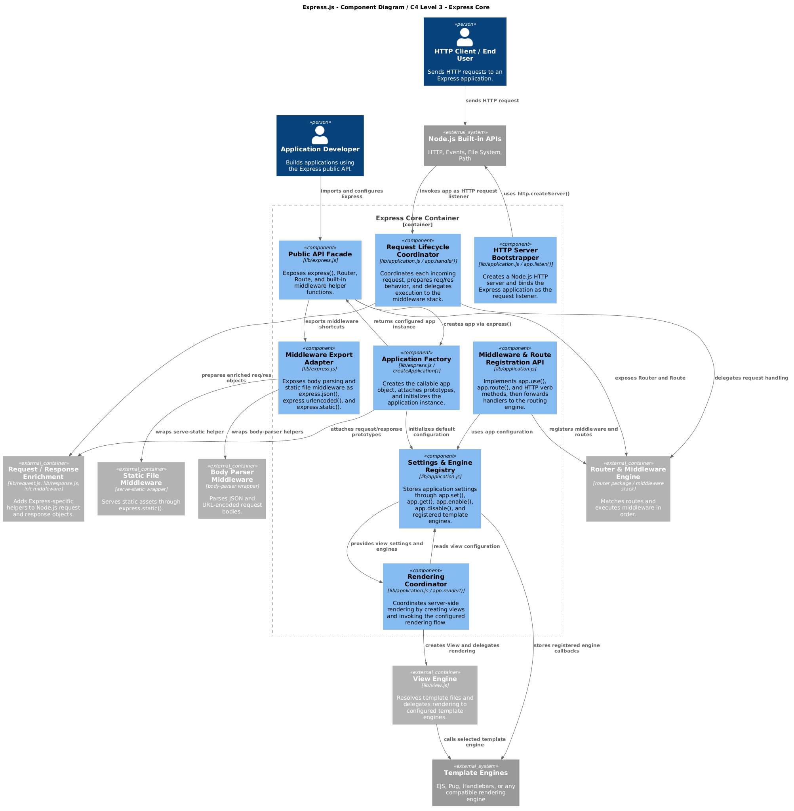

## 1. Context diagram - C4 Level 1 (draft)

### Diagram

The Express.js Context Diagram, modeled at C4 Level 1, provides a high-level architectural view of the Express.js web framework and its relationships with the surrounding actors and external systems. The diagram identifies two primary human actors the Application Developer and the HTTP Client / End User , alongside five external systems that Express.js depends on or integrates with. Together, these elements illustrate how Express.js sits at the center of a Node.js web application ecosystem, orchestrating HTTP communication, middleware processing, routing, and view rendering.

### Actors

The **Application Developer** is the person who builds web applications using Express.js. They interact with the framework by calling `require('express')()` and leveraging the public API to create application instances, register middleware, define routes, and configure view engines. The developer does not interact with the external systems directly through Express; rather, Express abstracts those interactions behind a clean, minimal API surface.

The **HTTP Client / End User** represents any browser, mobile application, or API consumer that initiates HTTP requests. These requests — carrying JSON, HTML, or other payloads — flow into the Express.js framework, which processes them through its middleware pipeline and returns appropriate HTTP responses. This bidirectional exchange forms the core runtime interaction of any Express-based application.

### The Central System

At the heart of the diagram is the **Express.js Framework** itself, classified as the `«system»` under analysis. It is a Node.js web framework responsible for creating application instances, managing the HTTP request/response lifecycle, executing the middleware pipeline, performing routing, and rendering views. Express acts as the orchestrator that connects all surrounding components, delegating specialized responsibilities to external packages and Node.js built-in modules.

### External Systems

Express.js interacts with five external systems, each fulfilling a distinct role in the overall architecture:

| External System | Role | Interaction with Express.js |
|---|---|---|
| **Node.js Built-in APIs** | Core runtime platform providing HTTP, Events, File System, and Path modules | Express uses `http.createServer()` inside `app.listen()`, and relies on `fs`, `path`, and `events` for file operations and event handling |
| **Template Engines** | Server-side HTML rendering (e.g., EJS, Pug, Handlebars) | Express loads and invokes the engine's `render` function when `res.render()` is called, enabling dynamic view generation |
| **router package** | External routing and middleware stack used by Express 5 | Express exposes `Router` and `Route` objects backed by this package, enabling modular route definitions and nested middleware chains |
| **serve-static** | Static file-serving middleware | Exported by Express as `express.static()`, allowing applications to serve CSS, JavaScript, images, and other static assets from a directory |
| **body-parser** | Request body parsing middleware for JSON, raw, text, and URL-encoded data | Exported as middleware helpers (`express.json()`, `express.urlencoded()`), enabling automatic parsing of incoming request bodies |

---

## 2. Container Level - C4 Level 2

### Tool used

The diagram below was produced with **Structurizr**, rendered natively in GitHub Markdown.

---

### Diagram

---

### Explanation of each container

**HTTP Client**  
Anything that sends an HTTP request to the server — a browser, a mobile app, a curl command, another service.

**Node.js HTTP Server** *(external)*  
The built-in `http` module creates a TCP socket, accepts connections, and calls the Express app function with the raw `IncomingMessage` (req) and `ServerResponse` (res) objects.

**Express Core** (`lib/express.js`, `lib/application.js`)  
This is the entry point of the framework. It creates the app object via the factory function, stores application-level settings (`app.set()`), registers template engines (`app.engine()`), and owns the top-level `app.use()` and routing methods. On each incoming request it triggers the request/response enrichment and hands off to the Router.

**Router & Middleware Engine** (`lib/router/`)  
This is the heart of the request pipeline. It holds an ordered stack of `Layer` objects — each one wrapping a middleware function or a route handler. When a request comes in, it walks the stack, matches the request path and method, and calls each matching handler in order. Calling `next()` advances to the next layer; not calling it stops the chain. Error-handling middleware (four-argument functions) is a special layer type reserved for propagating errors down the chain.

**Request / Response Enrichment** (`lib/request.js`, `lib/response.js`, `lib/middleware/init.js`)  
Node's raw `req` and `res` objects are intentionally minimal. This container is responsible for extending them at the start of every request by swapping their prototype chain. After enrichment, `req` gains helpers like `req.params`, `req.query`, `req.accepts()`, and `req.is()`; `res` gains `res.json()`, `res.send()`, `res.redirect()`, `res.cookie()`, and `res.render()`. This happens once per request with no extra object allocation.

**View / Template Engine** (`lib/view.js` + `app.engine()`)  
This container handles `res.render()` calls. It resolves the template file path, picks the registered engine for that file's extension, and delegates the actual rendering to it. The engine itself is external — Express only calls it via the agreed interface `fn(path, options, callback)`. One app can have multiple engines registered for different file extensions at the same time.

**Static File Middleware** (`serve-static` package)  
An optional middleware layer mounted with `app.use(express.static('public'))`. When a request path matches a file on the filesystem it reads and streams it directly, bypassing all route handlers. If no file matches, it calls `next()` and the request continues down the middleware stack.

**Template Library** *(external)*  
A third-party npm package such as `pug`, `ejs`, or `handlebars`. Express knows nothing about its internals — it just calls the registered function and waits for the callback.

**File System** *(external)*  
The operating system's file system, used both by the static middleware (to serve assets) and by the view engine (to read template files).

---

### Relationship with Clean Architecture

Clean Architecture organises code into concentric layers — from the outermost (frameworks and drivers) inward to use cases and entities — with the rule that dependencies only point inward and inner layers know nothing about outer ones.

Express does not enforce Clean Architecture, but it is strongly compatible with it, and the container diagram makes this visible. In our containers, the Node.js HTTP Server and Express Core correspond to the outer framework/driver layer, the Router & Middleware Engine plays the role of interface adapter, and the User Application container matches the use-case layer, while views and static middleware sit at the I/O boundary.

The main difference is that Express does not enforce this structure. There is nothing stopping a developer from putting database calls directly inside a route handler, which would mix use-case logic with interface adapter concerns and break the Clean Architecture principle.

---

## 3. Component Level - C4 Level 3

### Tool used

The component diagram was created using PlantUML with the C4-PlantUML library. This tool was selected because it supports the C4 model notation and allows diagrams to be stored as text-based files inside the project repository.

### Component Diagram

The following diagram zooms into the Express Core container, mainly represented by the `lib/` directory. It shows the main internal components of Express.js and their relationships with Node.js APIs, the external router package, middleware packages, and template engines.

### Component explanation

The component diagram focuses on the Express Core container of Express.js. The selected boundary is the `lib/` directory because it contains the main runtime implementation of the framework. External packages and Node.js built-in modules are shown as external dependencies and are not decomposed further.

The main entry point is `express.js`, which creates an Express application instance through `createApplication()`. This component exposes the public API used by application developers and connects the application object with the request and response prototypes.

The `application.js` component acts as the central application orchestrator. It manages application settings, middleware registration, routing delegation, mounted applications, server startup through `listen()`, and view rendering through `render()`.

The `request.js` component adapts Node.js `IncomingMessage` by adding Express-specific helper methods and properties. These include methods and properties for headers, content negotiation, protocol information, IP resolution, and query handling.

The `response.js` component adapts Node.js `ServerResponse` by adding high-level response helpers such as sending text or JSON responses, redirects, files, cookies, and rendered views.

The `view.js` component is responsible for resolving template files and invoking the selected template engine. It separates template lookup and rendering from the main application object.

The `utils.js` component provides shared helper functions used by other components, especially `application.js` and `response.js`. These utilities include ETag configuration, query parser configuration, trust proxy configuration, charset handling, and content-related helper functions.

### SOLID Principles Analysis

The table below summarises how the main core modules in `lib/` relate to the SOLID principles at component level.

| Principle | Assessment | Components and Analysis |
|----------|------------|-------------------------|
| **Single Responsibility (SRP)** | Partially satisfied | • `express.js`: mostly focused on creating the app and exposing the public API, so the responsibility is clear.  • `view.js`: only deals with template lookup and calling the selected engine, which fits SRP well.  • `application.js`: mixes settings, middleware registration, routing, template engine setup, rendering and `app.listen()`, so it clearly does more than one job.  • `response.js`: one large module that handles status, headers, cookies, JSON, file streaming, redirects and view rendering. |
| **Open/Closed (OCP)** | Good at extension points, weaker inside core | • Middleware (`app.use()`): new behaviour is usually added by registering extra middleware without touching core files.  • Views (`app.engine()` + `view.js`): new template engines can be plugged in through a stable callback API.  • `application.js` and `response.js`: when new features are added to Express itself, these modules are often edited, so they are not really “closed for modification”. |
| **Liskov Substitution (LSP)** | Largely respected by design | • `request.js` and `response.js`: extend `http.IncomingMessage` and `http.ServerResponse` but keep their original behaviour, so they can still be used where plain Node objects are expected.  • Template engines: can be swapped as long as they follow the expected `render(path, options, callback)` style contract. |
| **Interface Segregation (ISP)** | Mixed outcome | • From the application side, each middleware only uses a small set of methods on `req`, `res` and the app.  • Internally, `application.js`, `request.js` and especially `response.js` expose wide APIs that cover many different concerns; there are no smaller, dedicated interfaces for configuration, routing or response types. |
| **Dependency Inversion (DIP)** | Applied at public boundaries, limited inside HTTP layer | • Middleware and strategies: Express depends on simple function contracts (`(req, res, next)`, ETag functions, query parsers, trust‑proxy functions), which users can provide without changing the framework.  • Template engines: `view.js` calls engines via a generic render function and does not depend on a specific library.  • Inside `request.js` and `response.js`, the code imports concrete packages like `send`, `cookie`, `accepts` and `type-is` directly. |

## 4. Architectural Characteristics (draft)

To evaluate the overall quality of the Express.js architecture, we analyze its primary architectural characteristics (Quality Attributes) and demonstrate how they are structurally supported by the framework's design. To ground this analysis in objective software engineering principles, we support our reasoning using software metrics, specifically **Component Coupling** (inter-component dependencies) and **Cohesion** (intra-component single-purpose focus).

### 4.1 Extensibility and Maintainability

Extensibility is the defining architectural characteristic of Express.js, allowing developers to add arbitrary features without modifying the framework's core.

- **Supporting Architecture:** This attribute is achieved through the architectural decoupling of the core and the utilization of the *Chain of Responsibility* pattern via the middleware stack. The core system does not hardcode security, parsing, or logging mechanisms. Instead, it exposes a uniform pipeline where execution is delegated to independent middleware components.
- **Metrics-Based Evidence:** The system exhibits **High Functional Cohesion**. For instance, `lib/view.js` and `lib/utils.js` possess an internal Fan-out of 0 relative to other core modules. They are entirely isolated leaf nodes in the internal structural graph. This near-zero internal coupling ensures that the template engine or utility sub-systems can be maintained, refactored, or replaced independently without triggering unexpected ripple effects (low change propagation probability) across the application hub.

### 4.2 Modularity and Interoperability (The Micro-Package Philosophy)

Express.js prioritizes a lightweight core footprint by shifting computational complexity to the outer edges of its ecosystem.

- **Supporting Architecture:** Instead of building a monolithic web framework, the architecture heavily relies on delegating atomic responsibilities to specialized, standalone external npm packages (for example, `parseurl`, `send`, `accepts`).
- **Metrics-Based Evidence:** This strategy introduces an interesting architectural trade-off visible in the coupling metrics. Modules like `lib/response.js` present a very high external Fan-out (16), connecting to a wide array of single-purpose external utilities. While high coupling is traditionally a risk factor, here it signifies a deliberate design decision: Express delegates specialized protocol specifications (like mime-types, cookie signing, or content disposition) to the open-source community, keeping the core codebase highly cohesive and focused purely on routing and delegation HTTP contracts.

### 4.3 Performance and Low Overhead

As a foundational web framework, minimizing runtime performance overhead and memory latency is critical for high-throughput network applications.

- **Supporting Architecture:** The internal architecture avoids heavy abstractions, deep inheritance layers, or complex runtime dependency injection containers. Objects are structured as thin wrappers that directly extend Node.js native streams (`http.IncomingMessage` and `http.ServerResponse`).
- **Metrics-Based Evidence:** This is reflected in the Fan-in metrics of the request and response modules. They act as fundamental abstractions heavily utilized by the orchestrators (`lib/express.js` and `lib/application.js`). By relying on efficient runtime prototype mutation (`merge-descriptors` and prototype reassignment inside `lib/middleware/init.js`) rather than creating deep encapsulation layers or factory proxies, the architecture ensures that wrapping a raw HTTP network stream into an Express context happens with near-zero memory and execution overhead.

### 4.4 Architectural Characteristics Summary

| Quality Attribute | Architectural Mechanism | Supporting Coupling/Cohesion Metric |
| :--- | :--- | :--- |
| Extensibility | Middleware Pipeline (Chain of Responsibility) | High Functional Cohesion; internal Fan-out of 0 for leaf modules (`view.js`). |
| Maintainability | Facade Isolation (`lib/express.js`) | Low Change Propagation; entry point is isolated from core internal refactoring. |
| Modularity | Micro-package delegation model | High external Fan-out (16 in `response.js`) balancing low core complexity. |
| Performance | Direct Node.js prototype extension | Low abstraction depth; high structural Fan-in for core HTTP wrappers. |
