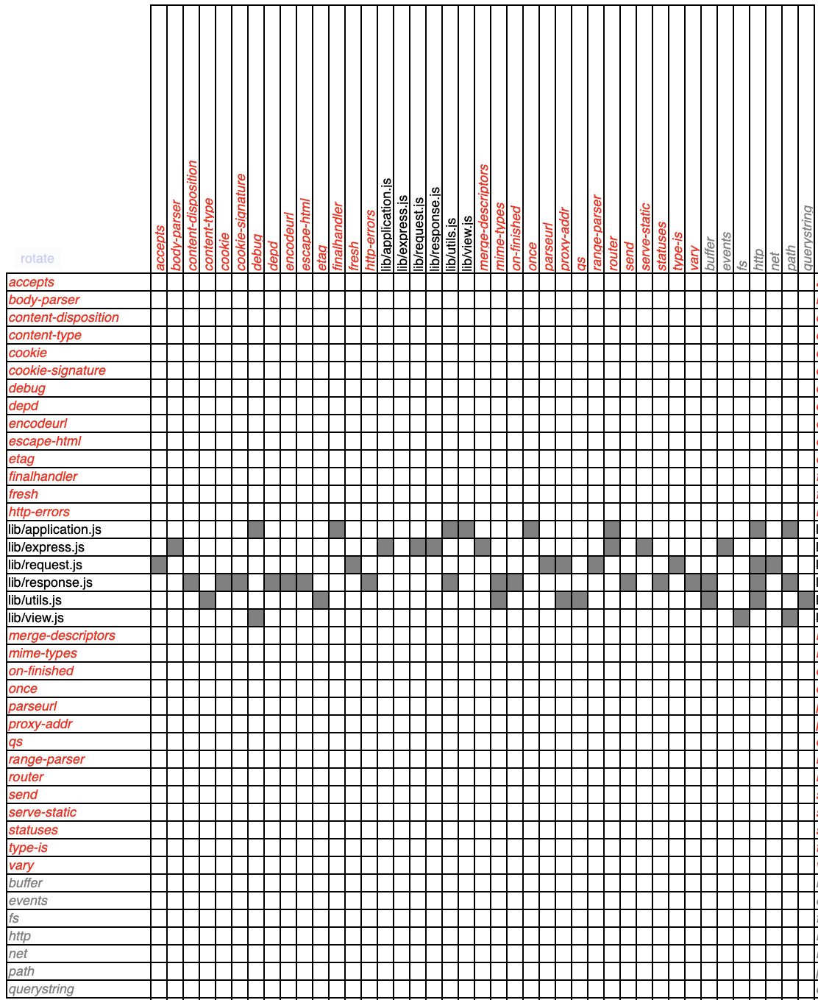

# Report Software Design

## 1. Dependencies

### 1.1 Methodology and Tools

To analyze the internal structure of Express.js, we focused on the core logic located in the `lib/` directory. We used **dependency-cruiser** to extract static code dependencies (`require` statements) and analyze structural coupling.

### 1.2 Code Dependencies (Results)

The analysis of the `lib/` directory revealed the following dependency metrics (Fan-in and Fan-out):

| Module | Fan-in | Fan-out | Architectural Role |
| :--- | :---: | :---: | :--- |
| `lib/express.js` | 0 | 8 | Entry Point |
| `lib/application.js` | 1 | 8 | Application Orchestrator |
| `lib/request.js` | 1 | 8 | HTTP Request Extender |
| `lib/response.js` | 1 | 16 | HTTP Response Extender |
| `lib/utils.js` | 2 | 8 | Internal Utilities |
| `lib/view.js` | 1 | 3 | Template View Renderer |

### 1.3 Findings and Structural Analysis

Based on the full dependency graph and the coupling metrics extracted via dependency-cruiser, several key architectural and design characteristics of Express.js can be identified:

#### 1. Architectural Roles and Orchestration

The system demonstrates a clear top-down hierarchical flow of control:

- **`lib/express.js` (Fan-in: 0, Fan-out: 8):** Acts as a classic **Facade pattern** and the main entry point. It has no internal incoming dependencies, isolating the framework's core from the external global scope, while its high Fan-out reflects its responsibility to assemble and export the factory functions.
- **`lib/application.js` (Fan-in: 1, Fan-out: 8):** Serves as the central **Orchestrator**. It manages the server's lifecycle, application settings, and the integration of the router, which explains its high outgoing coupling to both internal prototypes and core Node.js subsystems (like `events` and `http`).

#### 2. The Heavy Weight of HTTP Protocol Extensions

The most notable structural asymmetry lies in the request and response abstractions:

- **`lib/request.js` (Fan-in: 1, Fan-out: 8) & `lib/response.js` (Fan-in: 1, Fan-out: 16):** These modules extend Node.js native `http.IncomingMessage` and `http.ServerResponse` prototypes.
- The massive Fan-out of `response.js` (16) makes it the most complex and "heavy" component in the architecture. This high coupling is justified by its design requirements: a modern web response wrapper must natively support dozens of distinct formatting operations, header manipulations, file streaming (`send`), and view template rendering (`view.js`).

#### 3. Adherence to Low Coupling and the Node.js Philosophy

- **`lib/view.js` (Fan-out: 3) and `lib/utils.js` (Fan-out: 8):** These represent the leaf nodes of the internal dependency tree. Their minimal coupling demonstrates a strict application of the **Low Coupling** principle. They remain highly stable and can be tested or refactored independently.
- **Delegation over Reinvention:** The overall analysis highlights a fundamental philosophy of Express.js: instead of creating a monolith, the framework maintains an extremely thin core. For atomic, specialized tasks (such as parsing cookies, determining mime-types, or evaluating proxy addresses), the core modules delegate execution to small, independent npm micro-packages. This keeps the framework lightweight while reusing proven community solutions.

### 1.4 Knowledge Dependencies

### 2 Patterns
